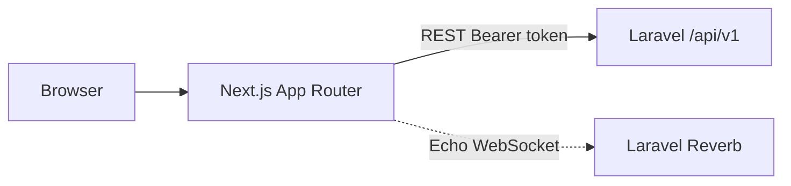

# VeriField Admin

Next.js admin console and public marketing/legal site for **VeriField**.

Talks to the Laravel API ([Verifield-backend](https://github.com/Bright-CG/Verifield-backend)). Field capture lives in [Verifield-mobile](https://github.com/Bright-CG/Verifield-mobile).

Default production site referenced in project config: `https://verifield.com.ng`  
API default: `https://api.verifield.com.ng`

---

## Overview

Tenant admins operate a war room (map + submissions), manage staff, review evidence certificates, and run EC8A extract/review/approve flows. Super admins manage tenants, branding, AI settings, and account-deletion requests. Public routes cover marketing, privacy/terms/support, signup, and store compliance (delete-account).

---

## Key Features

- [x] Login / signup / email verification flows against the API
- [x] Role-aware admin UI (`admin`, `super_admin`)
- [x] War room map (Leaflet) + Laravel Echo / Reverb client hooks
- [x] Submissions, dashboard, certificates, EC8A views
- [x] Staff management surfaces, system settings / AI benchmark (super admin)
- [x] Marketing pages + privacy, terms, support
- [x] Account deletion request form → API
- [x] GitHub Actions deploy (rsync + `npm ci` / `build` / pm2)

- [ ] Next.js middleware protecting all `(admin)` routes server-side (auth is primarily client token/localStorage based)
- [ ] Production Reverb always-on (depends on API/ops config)

---

## Stack

- Next.js ^16, React ^19, TypeScript
- Tailwind CSS, Framer Motion
- Leaflet / react-leaflet
- laravel-echo + pusher-js

---

## Architecture



```text
src/app/(admin)/     # Console pages
src/app/login|signup|…
src/app/privacy|terms|support|delete-account
src/components/
src/lib/             # API helpers, store links, etc.
```

---

## Environment

```bash
cp .env.example .env.local
```

```env
NEXT_PUBLIC_API_URL=http://localhost:8000
# Optional live map:
# NEXT_PUBLIC_REVERB_APP_KEY=
# NEXT_PUBLIC_REVERB_HOST=
# NEXT_PUBLIC_REVERB_WS_PORT=8080
# NEXT_PUBLIC_REVERB_FORCE_TLS=false
```

For production builds, set `NEXT_PUBLIC_API_URL` (and Reverb vars if used) **before** `npm run build`.

---

## Local setup

```bash
npm install
cp .env.example .env.local
# Point NEXT_PUBLIC_API_URL at a running VeriField API
npm run dev
```

Dev server binds to **http://localhost:3049** (`next dev -p 3049` in `package.json`).

```bash
npm run build
npm start          # default Next start port 3000 unless configured otherwise
npm run lint
```

---

## Deployment

[`.github/workflows/deploy.yml`](.github/workflows/deploy.yml) deploys on push to `V1.2` or `main` (and `workflow_dispatch`) via SSH rsync to `/home/verifield/admin`, then install/build/pm2 as defined in the workflow.

Secrets: `VERIFIELD_HOST`, `VERIFIELD_PORT`, `VERIFIELD_USER`, `VERIFIELD_SSH_KEY`, `VERIFIELD_PASSPHRASE`.

---

## Status

**Active development / MVP.** Console and public compliance pages are in place; treat live WebSocket and some metrics UI as ops/product-dependent.

---

## License

No `LICENSE` file in this repository. Rights reserved by the author unless stated otherwise.

---

## Author

**Bright Godwin** (`Bright-CG`) — [github.com/Bright-CG/Verifield-admin](https://github.com/Bright-CG/Verifield-admin)
